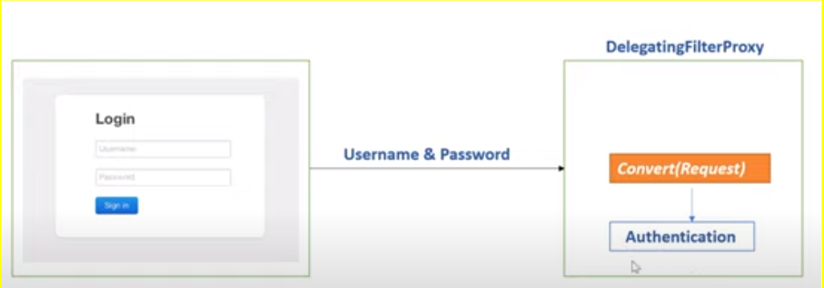
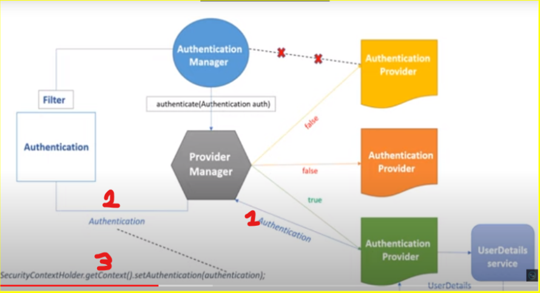

# spring-security-flow
How Spring Security internally works , demo application 

Set a breakpoint in the BasicAuthentication filter class inside the doFilterInternal method

The DelegatingFilterProxy is a servlet filter that allows passing control to Filter classes that have access to the Spring application context. 
Spring Security relies on this technique heavily.

Servlet filters works by intercepting the request before it reaches to the actual resource (e.g. Spring controller)

In the case illustrated above we use basic authentication with username and password 
and the DelegateFilterProxy invoke the BasicAuthenticationFilter in its filters chain.

Below is shown a rough outline of the authentication's flow

References: https://www.javadevjournal.com/spring-security/spring-security-filters/ 